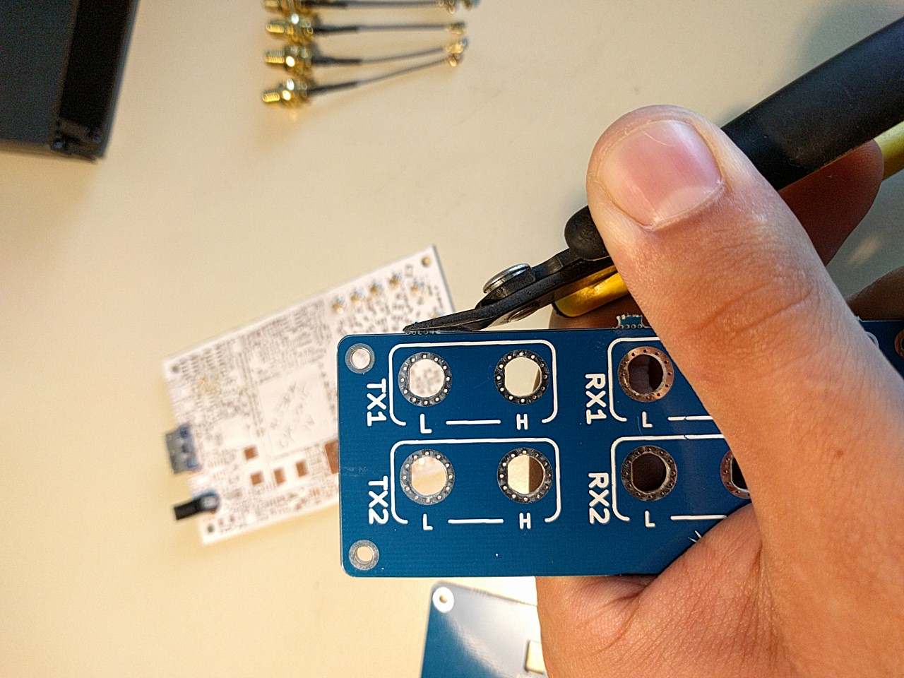
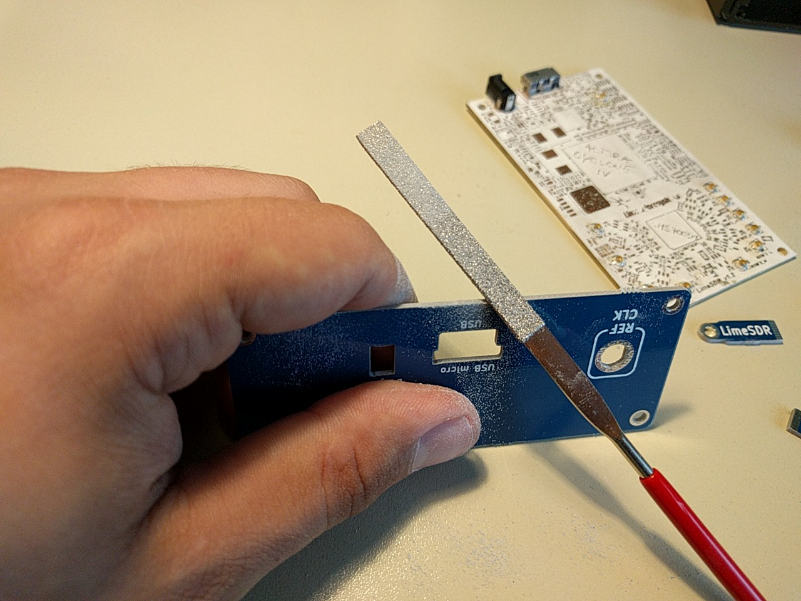
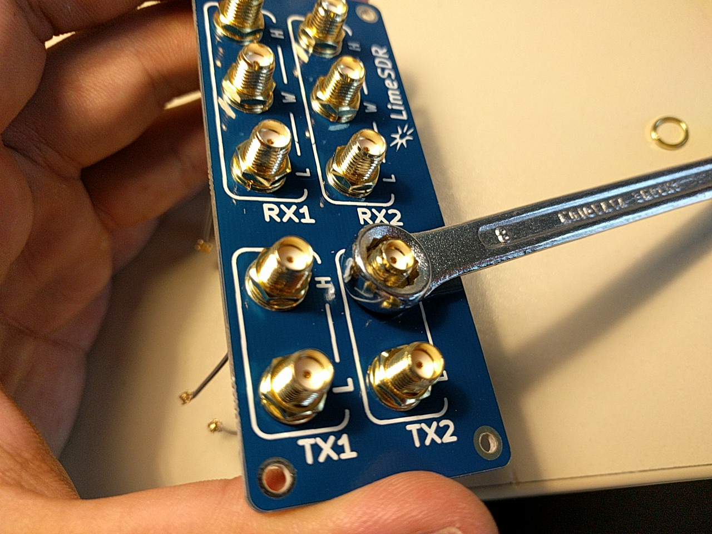
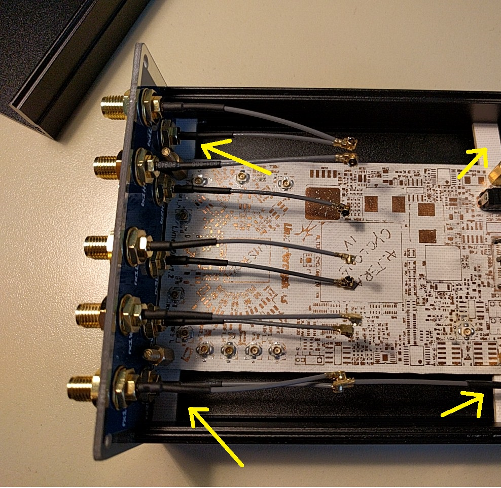
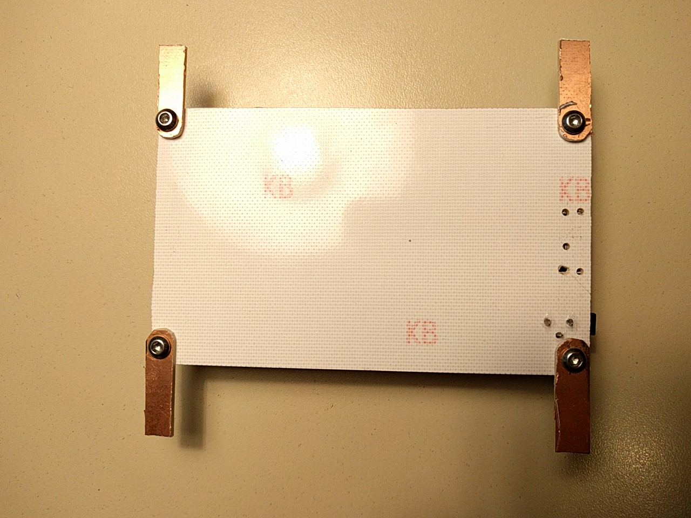
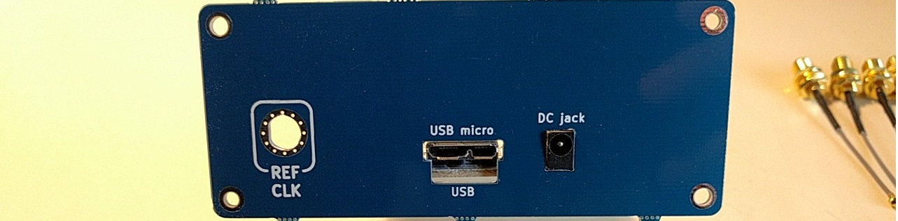

# Instruction for assembly

### Sorry BUT for 1st batch (Mid Avg.16) expect some filing. Hopefully not much. :/ :)

In the beginning your desk should look like this: (check BOM for separate parts and tools)

You may also need:

Firstly break apart the panel with wire cutters

Use straight file, too smooth the edges

Check if SMA connectors fit (1st batch had a bit too small holes), use curved file OR some drill OR force it

You can tighten connectors by holding panel and using a wrench (not a round hole)

When you have succesfully installed all connectors -> mount first panel on bottom part. Wait with installation of rear panel (because of fit)! Holding tabs must be placed from below of the LimeSDR. You can secure it with a short screw and a nut or like on photo. Then place the board inside the enclosure grooves

Now comes fitting the USB and DC socket (front panel and board with tabs already installed) in lower shell

Connect cables according datasheet/markings on the LimeSDR board

PLease place an issue if something should be improved. Thank you!