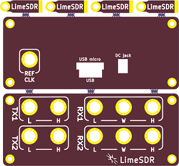
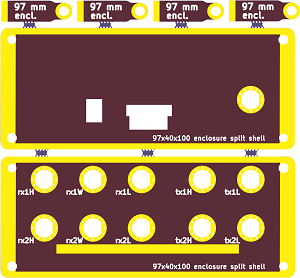

## TODO:
- BOM for this version "finished", which tools to add in kit (ikea style, all tools with kit)
- simple instruction for kit assembly 
- maybe any China/Hong Kong company would have/hold a kit for us?

## DONE:
- Fabricared PCB received.
- First sample sent to an owner of LimeSDR.

Coz 2 versions currently exist (micro and normal size USB), cutout for USB should accomodates both with remaining gap.

Images: 
[hardware/plug/1v2/Enclosure/](https://github.com/luftek/LimeSDR-USB/tree/master/hardware/plug/1v2/Enclosure/0v3_Alu_Sample_better_documentation/_images/)

Overview:

### + (positive)

- overall size OK
- thickness of 1.6 mm is sufficient, no need for a 2 mm pcb
- breaking tabs hold offset tabs firmly
- holes for SMA connectors right shape

### - (negative)

- holes for SMA connector slightly too small, about 0.1 - 0.2 mm (used a dimond file to remove excess material)
- gap for USB connector (two versions)

