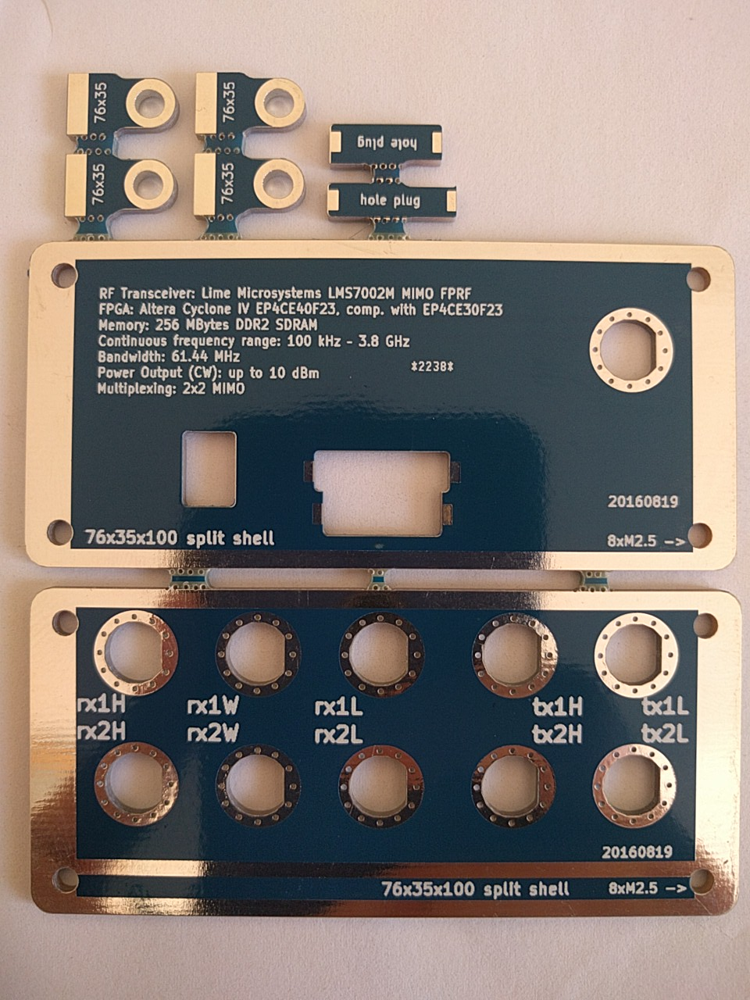

## DONE 76x35 panel:

- real 76x35 panel is solid
- SMA connectors fit, no filing needed
- fit is preatty tight, not "perfect" probably could reduce by 0.05 or 0.1 mm (I checked 1 panel, don't know how are others)
- hole to fill remaining opening for USB is great (some issue with pcb fab, like the used too big router)

### 2st batch for enclosure 76x35x100 selling on eBay [eBay listing](http://www.ebay.com/itm/NO-STOCK-LimeSDR-enclosure-front-rear-panel-case-rtl-sdr-myriad-hackrf-airspy-/112088499793)

