## Assembly instructions for LimeSDR KIT
#### 1. Checklist:
In the beginning check that you have everything available and ready
##### Materials:
You need to get separately LimeSDR board and 6x/12x SMA U.FL pigtails (5cm/2inch in this manual)
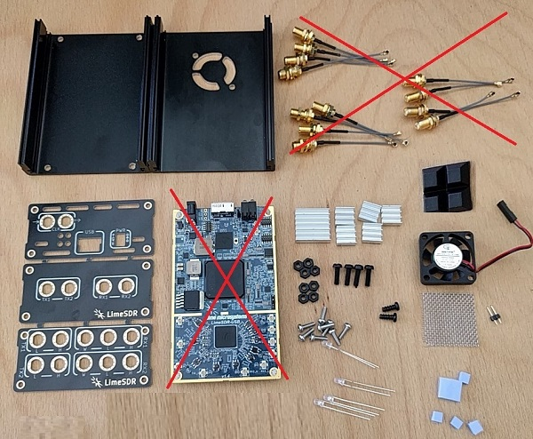

##### Checklist for KIT:
- alu shell bottom (4 holes)
- alu shell top (fan cutout, 2 holes)
- 4 rubber pads
- 4 plastic screws
- 8 plastic nuts
- fan 30x30 5v
- mesh
- pinheader
- heatpad (1pcs, cut later into more pcs)
- heatsinks (1x + 2x + 3x)
- PCB panel (2x front, rear)
- 8 panel screws, torx
- 4 bicolor LEDs

##### Tools:
- basic screwdriver set ([link]( https://www.ebay.com/sch/i.html?_nkw=31+in+1+screwdriver))
- sandpaper OR diamond files
- wrench size 8 (8 mm) for SMA pigtails
- soldering iron kit

photos needed
___
#### 2. Prepare LimeSDR board:
##### for FAN:
Populate 0.1" pinheader on the board
photos needed
##### for LEDs:
Solder all 4 bicolour LEDs
photos needed
___
#### 3. Mount fan on top shell:
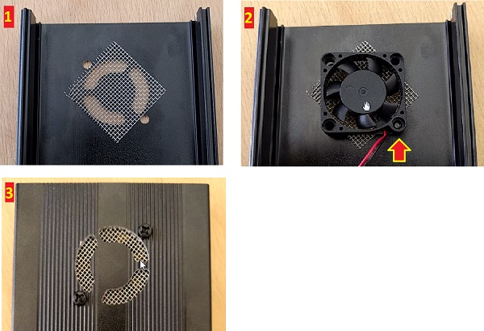

1. position steel mesh
2. place fan as on photo (exhaust fan, cable downward facing), partially screw one metal screw, align steel mesh to cover the cutout
3. mount 2nd screw and tighten both
___
#### 4. Mount "standoffs":
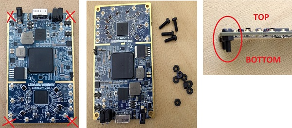

remove stock standoffs, put plastic screws from top and fix with plastic nut
___
#### 5. Cut and attach heatpad:
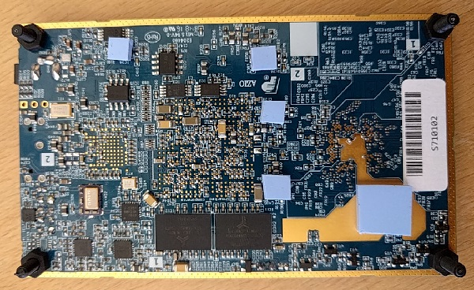

1. take scissors and cut 4 smaller pieces, mount them on voltage regul. (AP7361-FGE, IC28, IC30, IC33, IC34)
2. put remaining part on bare metal
___
#### 6. Screw on bottom shell:
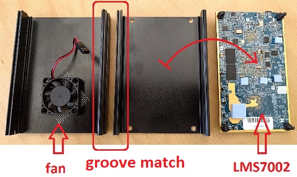

##### !!! WARNING: Orientation of both shells is very important when mounting, see shell groves
1. place all three components as on photo
1.a fan on bottom
1.b groves that fit together
1.c RF IC on bottom
2. turn bottom shell over and screw remaining 4 plastic nuts
___
#### 7. Attach rubber feet:
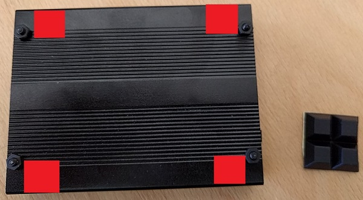

I attached them as red squares on photo
___
#### 8. Prepare front and rear panel:
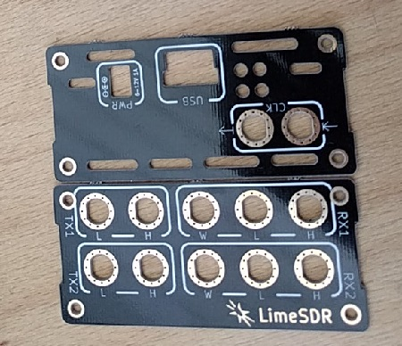

Chose how many SMA connectors you need on front panel, break tabs and use a diamond file or sandpaper. Use 8mm wrench to tighten SMA connectors firmly.

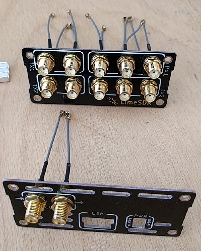

___
#### 9. Mount SMA pigtails:
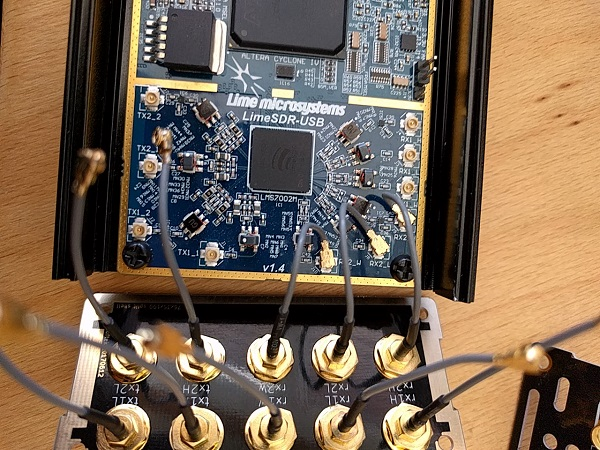

Attach pigtails as marked on panels
RX in v1.4 is marked as on front panel PCB
TX1_1 = tx1L, TX1_2 = tx1H  
TX2_1 = tx2L, TX2_2 = tx2H 
After attaching pigtails you are ready to slowly mount both panels. Rearrange pigtails as needed. Use torx screws for mounting.

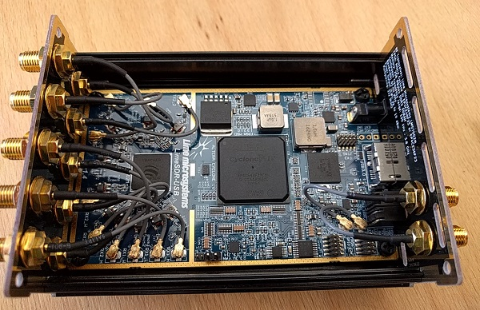
___
#### 10. Attach heatsinks and fan:
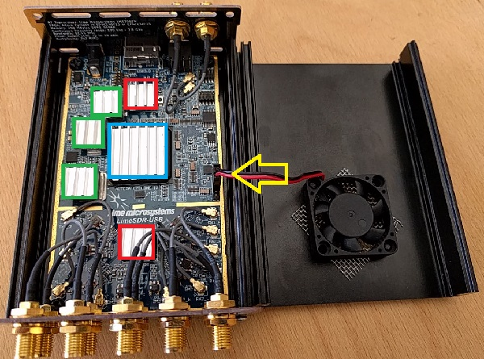

All heatsinks are rotated as airflow.
green - small | red - medium | blue - big
Fan connector as photo (red wire toward front panel)

Check FAN operation by manually changing state ON/OFF: https://github.com/luftek/LimeSDR-USB/issues/19

Continue using you LimeSDR! ;)
___
Please place an issue OR send eBay message if something should be improved. Thank you!

