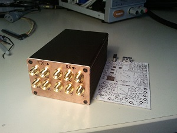
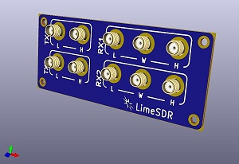
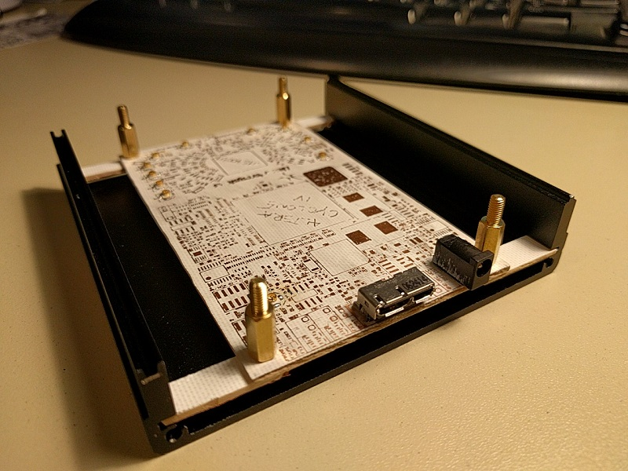

[Read version 1 for first try](https://github.com/luftek/LimeSDR-USB/tree/master/hardware/plug/1v2/Enclosure/0v1_Alu_Sample)

 

### In 0v2

I will try a different approach for placing pcb in enclosure. I will use wider enclosure due to issues of only narrow sideband available on LimeSDR PCB (slightly more than 1mm).
Also position SMA connectors more than 13 mm apart for direct connection of antenna. Latest min. 16 mm

I received 97 mm wide and 40 mm high enclosure split design. Front panel needs user input on LED placement.

## DONE?
Front panel needs user input on LED placement.

- design Front panel
	- 10x SMA connectors
- design rear panel
	- 1X SMA for clock
- design holding tabs and fix with M3 screw+nut (board is on top of tabs, clearence of bottom components)

 
 

## TODO:
- design holding tabs and fix with M3 screw+nut (board is on top of tabs, clearence of bottom components)
- and Rear panel
	-   two holes for micro USB and DC socket
- check needed lengths of cables from panel to board (currently it seems 5cm will be plenty)

[http://www.banggood.com/Black-Aluminum-Case-DIY-Project-Electronic-Line-Protection-Box-10x9_7x4cm-p-1018191.html](http://www.banggood.com/Black-Aluminum-Case-DIY-Project-Electronic-Line-Protection-Box-10x9_7x4cm-p-1018191.html)