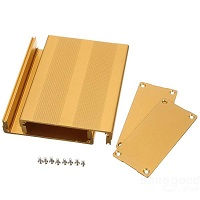

[Read version 1 for first try](https://github.com/luftek/LimeSDR-USB/tree/master/hardware/plug/1v2/Enclosure/0v1_Alu_Sample)

 

### In this version 0v2

I will try a different approach for placing pcb in enclosure. I will use wider enclosure due to issues of only narrow sideband available on LimeSDR PCB (slightly more than 1mm). 

I ordered 76 mm and 94 mm wide enclosures of 35 and 40 mm height. Length stays same 100 mm. New samples are also split design (bottom and top part)

## TODO:
- design holding tabs and fix with M3 screw+nut
- design Front panel
	-	10x SMA connectors
- and Back panel
	-	1X SMA for clock
	-   two holes for micro USB and DC socket
- check needed lengths of cables from panel to board