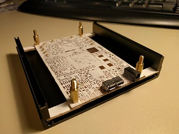

[Read version 2 for second](https://github.com/luftek/LimeSDR-USB/tree/master/hardware/plug/1v2/Enclosure/0v2_Alu_Sample_tabs)

 

### In 0v3

## DONE
First panels design files sent to PCB Fab
Now we wait a bit. No, I don't like to use DHL services. (their fees are in range of 15€+22%tax on top of customs)

## TODO:
- check BOM and prepare with all tools needed for assembly (also piece of abrasive paper, file for removing corners)
- send examples of enclosure and first pcb panel to owners of LimeSDR (1 volunteer currently)