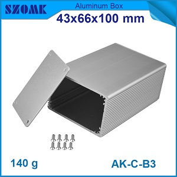
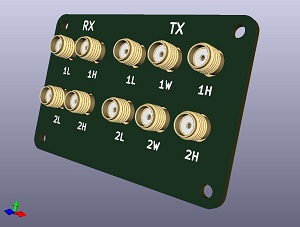

Already available suitable enclosures?

Decided for higher 43 mm enclosure to fit all 10 SMA connectors on front panel

Sample PCB:
1. main sample board in two parts 50x60, to see how it fits in Sample enclosure
2. Front and back panel with suitable ports, leds and dip switches

100x100 mm board samples from Dirty PCB?

### Sample Front Panel

KiCad 3d Viewer: Render with diff. SMA connectors then ordered suitable for this panel. For more context

## TODO:
- design sample PCB to accomodate all connectors that are present currently on LimeSDR
- design Front panel
	-	10x SMA connectors
	-	status leds
- and Back panel
	-	1X SMA for clock
	-   DIP
	-   LEDs
	- 	FPGA I/O

links:

[Aliexpress Sample Enclosure ](http://www.aliexpress.com/item/1-piece-free-shipping-aluminium-enclosures-junction-box-43-H-x66-W-X100-L-mm-for/32351356838.html)

